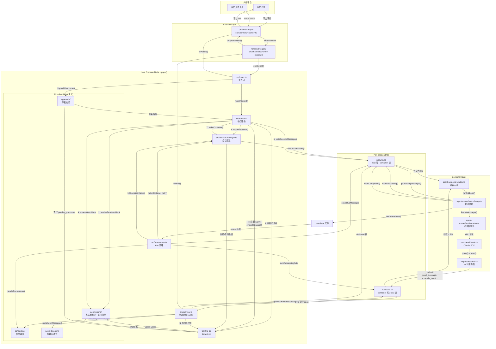
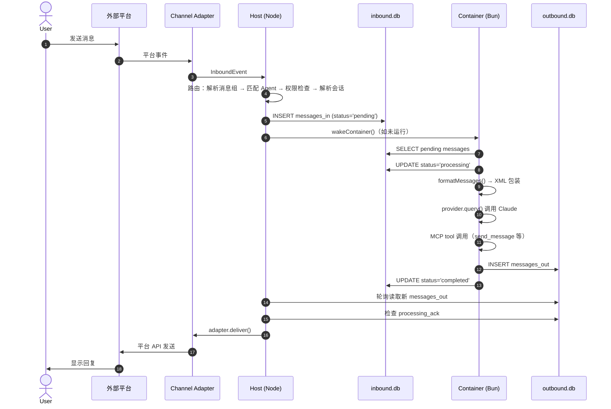

# NanoClaw v2 架构探索

> 探索日期：2026-05-08  
> 版本：nanoclaw@2.0.44  
> 目标：建立 codebase 完整地图，识别核心模块边界与二开安全区

---

## 1. src/ 全文件职责地图

src/ 共 90+ 个文件，按职责分为 10 个维度。每一行格式：`文件路径 — 一句话职责`。

### 1.1 Entry & Orchestration（进程入口与生命周期）

| 文件 | 职责 |
|------|------|
| `src/index.ts` | 主入口：初始化 DB → 迁移 → 容器运行时 → 渠道适配器 → 投递轮询 → 清理 sweep → 优雅关闭 |
| `src/response-registry.ts` | 响应处理器注册表 + 关闭回调注册表（打破循环依赖的独立模块） |
| `src/config.ts` | 共享配置常量：DATA_DIR、GROUPS_DIR、CONTAINER_IMAGE、TIMEZONE 等 |
| `src/env.ts` | 环境变量读取与校验 |
| `src/log.ts` | 日志封装（thin wrapper，单行日志） |
| `src/circuit-breaker.ts` | 启动退避机制（防止崩溃循环快速重启） |
| `src/state-sqlite.ts` | 状态 SQLite 辅助（用于 host-sweep 等） |

### 1.2 Routing（消息路由）

| 文件 | 职责 |
|------|------|
| `src/router.ts` | **核心路由**：渠道事件 → 消息组解析 → 发送者解析 → Agent 匹配（engage_mode 评估） → 访问控制 → 会话解析/创建 → 写入 inbound.db → 唤醒容器 |
| `src/command-gate.ts` | 斜杠命令门禁：白名单放行 / 管理员命令权限校验 / 过滤丢弃 |
| `src/platform-id.ts` | 平台 ID 规范化工具 |

**router.ts 中的 5 个 Hook 注册点**（模块通过它们注入行为）：
- `setSenderResolver` — 发送者解析（permissions 模块注册）
- `setAccessGate` — 访问控制（permissions 模块注册）
- `setSenderScopeGate` — 每接线发送者范围控制（permissions 模块注册）
- `setMessageInterceptor` — 消息拦截器（permissions 模块用于自由文本输入）
- `setChannelRequestGate` — 渠道注册审批（permissions 模块注册）

### 1.3 Delivery（消息投递）

| 文件 | 职责 |
|------|------|
| `src/delivery.ts` | **核心投递**：双轮询（1s 活跃 + 60s sweep）→ 读取 outbound.db → 过滤已投递 → 系统动作分发 → 渠道投递 → 附件读取 |
| `src/delivery.test.ts` | 投递逻辑测试 |

**delivery.ts 中的 2 个注册点**：
- `registerDeliveryAction(action, handler)` — 系统动作处理器注册（scheduling、self-mod、A2A 等模块注册）
- `onDeliveryAdapterReady(cb)` — 投递适配器就绪回调（approvals 模块注册 OneCLI 处理器）

### 1.4 Channel Adapters（渠道适配器）

| 文件 | 职责 |
|------|------|
| `src/channels/adapter.ts` | **ChannelAdapter 接口定义**：生命周期（setup/teardown）、投递（deliver）、打字指示（setTyping）、订阅（subscribe）、开 DM（openDM） |
| `src/channels/channel-registry.ts` | 渠道注册表：自注册模式，`registerChannelAdapter` + `getChannelAdapter` |
| `src/channels/channel-registry.test.ts` | 注册表测试 |
| `src/channels/index.ts` | **渠道 barrel**：每个渠道通过 `import './xxx.js'` 自注册。主干只带 `cli` |
| `src/channels/cli.ts` | CLI 渠道适配器（本地终端，始终启用） |
| `src/channels/chat-sdk-bridge.ts` | Chat SDK 桥接：将 Chat SDK 适配器包装为 NanoClaw 标准接口 |
| `src/channels/chat-sdk-bridge.test.ts` | 桥接测试 |
| `src/channels/ask-question.ts` | 提问卡片选项规范化 |

**渠道扩展机制**：新渠道通过 `/add-<channel>` skill 从 `channels` branch 复制代码 → 在 `src/channels/index.ts` 追加一行 `import './xxx.js'` → 自注册完成。

### 1.5 Session Management（会话生命周期）

| 文件 | 职责 |
|------|------|
| `src/session-manager.ts` | **会话核心**：会话解析/创建（3 种模式：shared/per-thread/agent-shared）、文件夹初始化、inbound/outbound DB 读写、附件提取/读取、心跳路径管理 |
| `src/db/session-db.ts` | 会话 DB 操作：schema 确保、消息插入、投递追踪、处理确认同步、重试机制 |
| `src/db/session-db.test.ts` | 会话 DB 测试 |

**跨挂载不变量**（load-bearing，绝对不能改）：
1. `journal_mode=DELETE` — WAL 的 shm 不会刷新 host→guest
2. Host 每次操作后打开-写入-**关闭** — 关闭使容器的页缓存失效
3. 每文件只有一个写入者 — DELETE 模式下的 journal-unlink 不是原子的

### 1.6 Container Runtime（容器运行时）

| 文件 | 职责 |
|------|------|
| `src/container-runner.ts` | **容器生命周期**：唤醒（wakeContainer）、生成（spawnContainer）、挂载构建、OneCLI 网关注入、镜像构建（buildAgentGroupImage） |
| `src/container-runner.test.ts` | 容器运行器测试 |
| `src/container-runtime.ts` | 运行时抽象：Docker 命令构建、host-gateway 参数、孤儿清理 |
| `src/container-runtime.test.ts` | 运行时测试 |
| `src/container-config.ts` | container.json 读写（ per-agent-group 配置） |
| `src/group-init.ts` | Agent group 文件系统初始化（CLAUDE.md、skills、agent-runner-src 覆盖） |
| `src/group-folder.test.ts` | 组文件夹测试 |
| `src/claude-md-compose.ts` | CLAUDE.md 组合：共享基础 + 启用 skill 片段 + MCP 指令 |
| `src/install-slug.ts` | 安装标识（用于容器标签隔离） |

### 1.7 Permissions & Access（权限、审批、用户管理）

| 文件 | 职责 |
|------|------|
| `src/modules/permissions/index.ts` | **权限模块入口**：注册 5 个 router hook + 2 个 response handler（发送者审批 + 渠道审批） |
| `src/modules/permissions/access.ts` | `canAccessAgentGroup`：owner / global admin / scoped admin / member 层级判断 |
| `src/modules/permissions/channel-approval.ts` | 渠道注册审批流程（选择现有 Agent / 创建新 Agent） |
| `src/modules/permissions/channel-approval.test.ts` | 渠道审批测试 |
| `src/modules/permissions/sender-approval.ts` | 未知发送者审批流程 |
| `src/modules/permissions/sender-approval.test.ts` | 发送者审批测试 |
| `src/modules/permissions/user-dm.ts` | 冷 DM 解析与缓存（ensureUserDm） |
| `src/modules/permissions/permissions.test.ts` | 权限测试 |

**Permissions DB 层**（`src/modules/permissions/db/`）：
- `users.ts` — users 表 CRUD
- `user-roles.ts` — user_roles 表 CRUD + 管理员判断
- `agent-group-members.ts` — agent_group_members 表 CRUD
- `pending-channel-approvals.ts` — pending_channel_approvals 表 CRUD
- `pending-sender-approvals.ts` — pending_sender_approvals 表 CRUD
- `user-dms.ts` — user_dms 表 CRUD

### 1.8 Database Layer（数据库层）

| 文件 | 职责 |
|------|------|
| `src/db/connection.ts` | Central DB 连接单例（better-sqlite3）、WAL 模式、hasTable 工具 |
| `src/db/schema.ts` | **Schema 文档**：当前 central DB + session DB（inbound/outbound）的完整 CREATE TABLE 语句 |
| `src/db/index.ts` | DB barrel：重导出所有 CRUD 函数 |
| `src/db/agent-groups.ts` | agent_groups 表 CRUD |
| `src/db/messaging-groups.ts` | messaging_groups + messaging_group_agents 表 CRUD |
| `src/db/sessions.ts` | sessions + pending_questions + pending_approvals 表 CRUD |
| `src/db/dropped-messages.ts` | dropped_messages 表 CRUD（审计） |
| `src/db/db-v2.test.ts` | DB 层测试 |

**Migrations**（`src/db/migrations/`）：
- `index.ts` — 迁移运行器（检查 schema_version，按序应用）
- `001-initial.ts` — 初始 schema
- `002-chat-sdk-state.ts` 到 `013-approval-render-metadata.ts` — 增量迁移
- `module-*.ts` — 模块专属迁移（agent-to-agent destinations、approvals pending_approvals、approvals title-options）

### 1.9 Modules（功能模块）

| 文件 | 职责 |
|------|------|
| `src/modules/index.ts` | **模块 barrel**：导入所有注册型模块（ approvals → interactive → scheduling → permissions → agent-to-agent → self-mod ） |
| `src/modules/approvals/index.ts` | 审批模块入口：注册 response handler + OneCLI 审批处理器 |
| `src/modules/approvals/primitive.ts` | 审批原语：`requestApproval`、`registerApprovalHandler`、`pickApprover`、`pickApprovalDelivery` |
| `src/modules/approvals/picks.test.ts` | 审批人选择测试 |
| `src/modules/approvals/response-handler.ts` | 审批响应分发器 |
| `src/modules/approvals/onecli-approvals.ts` | OneCLI 凭证审批桥接 |
| `src/modules/interactive/index.ts` | 交互模块：ask_user_question 卡片投递与响应追踪 |
| `src/modules/scheduling/index.ts` | 调度模块：注册 5 个 delivery action（schedule/cancel/pause/resume/update_task） |
| `src/modules/scheduling/actions.ts` | 调度动作实现 |
| `src/modules/scheduling/db.ts` | 调度相关 DB 操作 |
| `src/modules/scheduling/recurrence.ts` | 周期性任务处理 |
| `src/modules/scheduling/recurrence.test.ts` | 周期性任务测试 |
| `src/modules/scheduling/db.test.ts` | 调度 DB 测试 |
| `src/modules/agent-to-agent/index.ts` | A2A 模块入口：注册 `create_agent` delivery action |
| `src/modules/agent-to-agent/agent-route.ts` | A2A 消息路由：channel_type='agent' 时的投递逻辑 |
| `src/modules/agent-to-agent/agent-route.test.ts` | A2A 路由测试 |
| `src/modules/agent-to-agent/create-agent.ts` | A2A 动态创建 Agent |
| `src/modules/agent-to-agent/write-destinations.ts` | 将 A2A 目标写入 session DB 的 destinations 表 |
| `src/modules/agent-to-agent/db/agent-destinations.ts` | agent_destinations 表 CRUD |
| `src/modules/self-mod/index.ts` | 自修改模块：注册 install_packages / add_mcp_server delivery action + approval handler |
| `src/modules/self-mod/request.ts` | 自修改请求处理（验证输入 → 发起审批） |
| `src/modules/self-mod/apply.ts` | 自修改应用（更新 container.json → 重建镜像/重启容器） |
| `src/modules/typing/index.ts` | 打字指示器模块：start/stop/pause typing refresh |
| `src/modules/mount-security/index.ts` | 挂载安全检查：验证 additionalMounts 路径安全 |

### 1.10 Providers（模型提供商）

| 文件 | 职责 |
|------|------|
| `src/providers/index.ts` | Provider barrel：主干只导入 `claude` |
| `src/providers/claude.ts` | Claude 提供商的 host-side 容器配置贡献（目前为空，claude 不需要额外配置） |
| `src/providers/provider-container-registry.ts` | 提供商容器配置注册表：`registerProviderContainerConfig`、`getProviderContainerConfig` |

**容器内 Provider**（`container/agent-runner/src/providers/`）：
- `index.ts` — barrel（主干只注册 `claude`）
- `factory.ts` — `createProvider` 工厂
- `claude.ts` — Claude Agent SDK 包装
- `mock.ts` — 测试用 mock provider
- `types.ts` — Provider 接口定义

### 1.11 Utilities（工具函数）

| 文件 | 职责 |
|------|------|
| `src/types.ts` | **所有 TypeScript 类型定义**：Central DB 实体、Session DB 实体、Pending 实体 |
| `src/attachment-naming.ts` | 附件命名推导 |
| `src/attachment-naming.test.ts` | 附件命名测试 |
| `src/attachment-safety.ts` | 附件名称安全检查（防止路径逃逸） |
| `src/timezone.ts` / `timezone.test.ts` | 时区工具 |
| `src/webhook-server.ts` | Webhook 服务器（如有） |

### 1.12 Tests（测试文件分布）

测试与源码紧邻分布（`*.test.ts`），使用 vitest。测试文件列表：
- `src/host-core.test.ts` — 核心主机流程测试（路由、投递、会话管理集成）
- `src/delivery.test.ts` — 投递逻辑测试
- `src/container-runner.test.ts` — 容器运行器测试
- `src/container-runtime.test.ts` — 容器运行时测试
- `src/circuit-breaker.test.ts` — 电路断路器测试
- `src/group-folder.test.ts` — 组文件夹测试
- `src/host-sweep.test.ts` — 主机清理测试
- `src/db/db-v2.test.ts` — DB 层测试
- `src/db/session-db.test.ts` — 会话 DB 测试
- `src/modules/permissions/permissions.test.ts` — 权限测试
- `src/modules/permissions/sender-approval.test.ts` — 发送者审批测试
- `src/modules/permissions/channel-approval.test.ts` — 渠道审批测试
- `src/modules/scheduling/db.test.ts` — 调度 DB 测试
- `src/modules/scheduling/recurrence.test.ts` — 周期性任务测试
- `src/modules/agent-to-agent/agent-route.test.ts` — A2A 路由测试

---

## 2. 四大核心模块职责边界

### 2.1 src/channels/ — 渠道适配层

**职责一句话**：将平台消息标准化为 NanoClaw 的 `InboundEvent`，并将 NanoClaw 的 `OutboundMessage` 投递回平台。

**文件清单**：
- `adapter.ts` — 接口契约（ChannelAdapter、InboundEvent、OutboundMessage、ChannelSetup）
- `channel-registry.ts` — 注册表（Map<string, ChannelRegistration>）
- `index.ts` — barrel（import 触发自注册）
- `cli.ts` — CLI 适配器实现
- `chat-sdk-bridge.ts` — Chat SDK 桥接实现

**对外暴露的接口**：
```typescript
// 注册新渠道（在渠道模块的顶层调用）
registerChannelAdapter(name, { factory, containerConfig? })

// 获取已激活的渠道适配器
getChannelAdapter(channelType): ChannelAdapter | undefined

// 获取渠道的容器配置（额外挂载/环境变量）
getChannelContainerConfig(name): { mounts?, env? }
```

**依赖关系**：
- 消费：无（最底层，只被消费）
- 被消费：`src/index.ts`（初始化）、`src/delivery.ts`（投递）、`src/router.ts`（订阅）、`src/modules/permissions/user-dm.ts`（开 DM）

**关键数据结构**：
- `InboundEvent` — 渠道 → 主机的标准化消息
- `OutboundMessage` — 主机 → 渠道的投递消息
- `ChannelAdapter` — 渠道必须实现的接口

**修改安全度**：⭐⭐⭐⭐⭐（高度安全）  
添加新渠道 = 新增文件 + barrel 加一行 import，不会与 upstream 冲突。

---

### 2.2 src/modules/ — 功能模块层

**职责一句话**：通过注册表模式向核心（router/delivery/response-registry）注入行为，实现可插拔功能。

**文件清单**（按模块分组）：

| 模块 | 注册点 | 功能 |
|------|--------|------|
| `approvals/` | response-registry + onDeliveryAdapterReady | 审批原语 + OneCLI 凭证审批 |
| `permissions/` | 5 个 router hook + 2 个 response handler | 发送者解析、访问控制、渠道/发送者审批流程 |
| `scheduling/` | 5 个 delivery action + host-sweep MODULE-HOOK | 一次性/周期性任务调度 |
| `agent-to-agent/` | 1 个 delivery action + container-runner 动态 import + delivery 动态 import | 代理间通信、动态创建代理 |
| `self-mod/` | 2 个 delivery action + 2 个 approval handler | 自修改（安装包、添加 MCP 服务器） |
| `interactive/` | delivery 中的 pending_questions 逻辑（无显式注册） | 交互卡片（ask_user_question） |
| `typing/` | 被 router/delivery/container-runner 直接 import | 打字指示器管理 |
| `mount-security/` | 被 container-runner 直接 import | 额外挂载安全检查 |

**对外暴露的接口**（模块间公共 API）：
```typescript
// approvals/primitive.ts
export { requestApproval, registerApprovalHandler, notifyAgent }

// permissions/access.ts
export { canAccessAgentGroup }

// permissions/user-dm.ts
export { ensureUserDm }
```

**依赖关系**：
- 模块之间通过 `../../delivery.js`、`../../router.js`、`../../response-registry.js` 等相对路径导入核心
- approvals 是默认层模块，self-mod 依赖 approvals
- 模块不直接互相调用（除了 self-mod → approvals）

**修改安全度**：⭐⭐⭐⭐（较安全）  
添加新模块 = 新建目录 + `src/modules/index.ts` 加一行 import。现有模块的修改不会影响其他模块。

---

### 2.3 src/db/ — 数据库层

**职责一句话**：Central DB 和 Session DB 的所有 CRUD 操作、迁移管理。

**文件清单**：
- `connection.ts` — Central DB 单例（better-sqlite3）
- `schema.ts` — Schema 文档（纯参考，不用于运行时）
- `migrations/index.ts` — 迁移运行器
- `migrations/001-*.ts` 到 `013-*.ts` — 编号迁移文件
- `agent-groups.ts` — agent_groups CRUD
- `messaging-groups.ts` — messaging_groups + messaging_group_agents CRUD
- `sessions.ts` — sessions + pending_questions + pending_approvals CRUD
- `dropped-messages.ts` — dropped_messages CRUD
- `session-db.ts` — Session DB（inbound/outbound）操作

**对外暴露的接口**：
```typescript
// connection.ts
export { initDb, getDb, hasTable, initTestDb, closeDb }

// 各实体文件导出的 CRUD 函数（见 src/db/index.ts）
export { createAgentGroup, getAgentGroup, ... } from './agent-groups.js'
export { createMessagingGroup, getMessagingGroup, ... } from './messaging-groups.js'
export { createSession, getSession, ... } from './sessions.js'
```

**依赖关系**：
- 消费：被几乎所有上层模块消费
- 被消费：无（最底层）

**关键数据结构**（Central DB）：
- `agent_groups` — Agent 工作区
- `messaging_groups` — 平台对话组
- `messaging_group_agents` — 接线关系（engage_mode、session_mode 等）
- `users` / `user_roles` / `agent_group_members` — 身份与权限
- `sessions` — 会话状态
- `pending_questions` / `pending_approvals` — 待处理交互

**Session DB 架构**（每个会话两个独立 SQLite 文件）：
- `inbound.db`（host 写，container 读）：messages_in、delivered、destinations、session_routing
- `outbound.db`（container 写，host 读）：messages_out、processing_ack、session_state、container_state

**修改安全度**：⭐⭐⭐（中等）  
新增实体 = 新增 CRUD 文件 + 迁移文件 + barrel 导出。修改现有 schema 需要新迁移文件。冲突风险较低。

---

### 2.4 container/ — Agent 容器运行时

**职责一句话**：在隔离容器中运行 Agent，通过 Session DB 与主机通信。

**文件清单**：

**容器构建**：
- `container/Dockerfile` — Agent 容器镜像定义
- `container/build.sh` — 镜像构建脚本
- `container/entrypoint.sh` — 容器入口脚本
- `container/.dockerignore` — Docker 忽略文件

**Agent Runner**（Bun 运行时，独立包树）：
- `container/agent-runner/package.json` — 依赖（Bun + @anthropic-ai/claude-agent-sdk + @modelcontextprotocol/sdk）
- `container/agent-runner/tsconfig.json` — 独立 TS 配置
- `container/agent-runner/bun.lock` — Bun 锁文件

**Agent Runner 源码**（`container/agent-runner/src/`）：
- `index.ts` — 容器入口：加载配置 → 构建系统提示 → 创建 Provider → 启动轮询循环
- `poll-loop.ts` — **核心轮询**：poll messages_in → format → provider.query() → write messages_out
- `config.ts` — 读取 /workspace/agent/container.json
- `formatter.ts` — 消息格式化（XML 包装、路由提取、命令分类）
- `destinations.ts` — 目的地解析（`<message to="name">` → 写入 messages_out）
- `current-batch.ts` — 当前批次 in_reply_to 追踪（用于 A2A 返回路径）
- `compact-instructions.ts` — 上下文压缩指令

**Agent Runner DB**（`container/agent-runner/src/db/`）：
- `connection.ts` — Session DB 连接（bun:sqlite）、心跳、清理 stale processing acks
- `messages-in.ts` — 读取 pending、标记 processing/completed
- `messages-out.ts` — 写入 messages_out
- `session-routing.ts` — 读取 destinations/session_routing
- `session-state.ts` — 续期状态存储（continuation）

**Agent Runner MCP Tools**（`container/agent-runner/src/mcp-tools/`）：
- `server.ts` — MCP 服务器入口
- `index.ts` — tool barrel
- `types.ts` — tool 类型定义
- `core.ts` — 核心工具：send_message、send_file、schedule_task、list_tasks、pause/resume/cancel_task
- `interactive.ts` — 交互工具：ask_user_question
- `scheduling.ts` — 调度工具（与 core 的 schedule_task 互补）
- `self-mod.ts` — 自修改工具：install_packages、add_mcp_server
- `agents.ts` — A2A 工具：send_to_agent
- `*.instructions.md` — 各工具的 LLM 指令（注入系统提示）

**Agent Runner Providers**（`container/agent-runner/src/providers/`）：
- `factory.ts` — `createProvider(name)` 工厂
- `claude.ts` — Claude Agent SDK 包装（query/push/events/continuation）
- `mock.ts` — 测试 mock
- `types.ts` — Provider 接口（AgentProvider、AgentQuery、ProviderEvent）

**Container Skills**（`container/skills/`）：
- `onecli-gateway/` — OneCLI 网关说明（凭证注入代理）
- `welcome/` — 欢迎消息 skill
- `self-customize/` — 自定制 skill
- `agent-browser/` — 浏览器工具 skill
- `slack-formatting/` — Slack 格式化 skill
- `vercel-cli/` — Vercel CLI skill
- `frontend-engineer/` — 前端工程师 skill

**挂载结构**（容器内视角）：
```
/workspace/
  inbound.db         ← host 写，container 读（RO 挂载）
  outbound.db        ← container 写，host 读
  .heartbeat         ← container touch，host 读 mtime
  outbox/            ← 附件输出目录
  agent/             ← agent group 文件夹（RW）
    CLAUDE.md        ← 组合后的系统提示（RO 嵌套挂载）
    container.json   ← 运行时配置（RO 嵌套挂载）
    CLAUDE.local.md  ← 组级记忆（RW）
  global/            ← 全局记忆（RO）
/app/src/            ← agent-runner 源码（RO）
/app/skills/         ← 共享 skills（RO）
/home/node/.claude/  ← Claude SDK 状态 + skill 符号链接（RW）
```

**修改安全度**：⭐⭐⭐⭐（较安全）  
- 添加新 MCP tool = 新增文件 + barrel 加一行。安全。
- 添加新 Provider = 新增文件 + barrel 加一行。安全。
- 修改 poll-loop = 影响核心行为，需谨慎。
- 修改 formatter = 影响所有 Agent 的输入格式，需谨慎。

---

## 3. 扩展点分析

### 3.1 稳定 API（修改不会与 upstream 冲突）

| 扩展点 | 如何扩展 | 冲突风险 |
|--------|----------|----------|
| **新渠道** | 新增 `src/channels/<name>.ts` → 在 `src/channels/index.ts` 加 `import './<name>.js'` | ⭐ 极低 |
| **新 Provider** | Host：新增 `src/providers/<name>.ts` → `src/providers/index.ts` 加 import；Container：新增 `container/agent-runner/src/providers/<name>.ts` → `providers/index.ts` 加 import | ⭐ 极低 |
| **新 MCP Tool** | 新增 `container/agent-runner/src/mcp-tools/<name>.ts` → `mcp-tools/index.ts` 加 import | ⭐ 极低 |
| **新 Skill** | 新增 `container/skills/<name>/SKILL.md`（+ 可选代码）→ 在 container.json 中启用 | ⭐ 极低 |
| **新模块** | 新增 `src/modules/<name>/` → `src/modules/index.ts` 加 import | ⭐ 极低 |
| **新 Delivery Action** | 调用 `registerDeliveryAction(action, handler)` | ⭐ 极低 |
| **新 Response Handler** | 调用 `registerResponseHandler(handler)` | ⭐ 极低 |
| **新 Approval Handler** | 调用 `registerApprovalHandler(action, handler)` | ⭐ 极低 |
| **新 DB 实体** | 新增 `src/db/<entity>.ts` → `src/db/index.ts` 重导出 + 新增迁移文件 | ⭐⭐ 低 |
| **新 Router Hook** | 调用 `setSenderResolver` / `setAccessGate` / `setSenderScopeGate` / `setMessageInterceptor` / `setChannelRequestGate` | ⭐⭐ 低 |

### 3.2 内部实现（修改需谨慎、易冲突）

| 区域 | 为什么不能随意改 | 修改风险 |
|------|----------------|----------|
| `src/router.ts` 核心路由逻辑 | 消息流转的核心，改动影响所有渠道 | 🔴 高 |
| `src/delivery.ts` 核心投递逻辑 | 双轮询、系统动作分发、渠道权限校验 | 🔴 高 |
| `src/session-manager.ts` 会话管理 | 跨挂载 DB 访问、附件安全 | 🔴 高 |
| `src/container-runner.ts` 容器生成 | OneCLI 注入、挂载构建、镜像构建 | 🔴 高 |
| `src/host-sweep.ts` 清理逻辑 | 容器 stuck 检测、消息重试、周期性任务 | 🔴 高 |
| `container/agent-runner/src/poll-loop.ts` | 轮询核心、并发推送、查询生命周期 | 🔴 高 |
| `container/agent-runner/src/formatter.ts` | 消息格式化、XML 包装、命令分类 | 🟡 中高 |
| `src/db/connection.ts` WAL/外键设置 | 跨挂载可见性的 load-bearing 配置 | 🔴 极高 |
| `src/db/session-db.ts` schema 确保 | 双 DB 结构的关键 | 🔴 高 |
| `src/index.ts` 主入口 | 初始化顺序 load-bearing | 🟡 中 |
| `src/types.ts` 核心类型 | 改动影响全系统 | 🟡 中 |

### 3.3 Skill 扩展机制详解

NanoClaw 的所有扩展都通过 **Skill** 完成。Skill 是 idempotent 的脚本/指令，从 long-lived branch 复制代码到主干。

**4 种 Skill 类型**：

| 类型 | 示例 | 修改范围 |
|------|------|----------|
| **Channel/Provider 安装 Skill** | `/add-discord`、`/add-slack`、`/add-opencode` | 复制模块 → 修改 barrel → pnpm install → build |
| **Utility Skill** | `/claw` | 添加代码文件 + SKILL.md |
| **Operational Skill** | `/setup`、`/debug`、`/customize` | 纯指令，不修改代码 |
| **Container Skill** | `container/skills/welcome/` | 添加容器内 skill（被挂载到所有 Agent） |

**Skill 安装的核心模式**（以 `/add-discord` 为例）：
1. `git fetch origin channels`
2. 从 `channels` branch 复制 `src/channels/discord.ts` 到主干
3. 在 `src/channels/index.ts` 追加 `import './discord.js'`
4. `pnpm install discord-adapter@<pinned-version>`
5. `pnpm run build`

**这个模式确保**：不同 skill 之间不冲突（只要它们修改不同的文件或 barrel 的不同行）。

---

## 4. 消息流 Mermaid 图

### 4.1 完整消息生命周期



### 4.2 简化版：消息从进入到返回



---

## 5. 二开安全区总结表

### 5.1 按二开目标查表

| 你想做 | 改这些文件 | 绝对不要碰 | 参考 Skill |
|--------|-----------|-----------|-----------|
| **添加新渠道**（微信/飞书/钉钉） | `src/channels/<name>.ts`（新建）<br>`src/channels/index.ts`（+1 行 import） | `src/router.ts`、`src/delivery.ts` 核心逻辑 | `/add-discord`、`/add-slack` |
| **添加新模型 Provider** | Host: `src/providers/<name>.ts` + `index.ts`<br>Container: `container/agent-runner/src/providers/<name>.ts` + `index.ts` | `src/container-runner.ts` 的 Provider 解析逻辑 | `/add-opencode` |
| **添加新 MCP Tool** | `container/agent-runner/src/mcp-tools/<name>.ts`（新建）<br>`mcp-tools/index.ts`（+1 行 import）<br>可选：`*.instructions.md` | `poll-loop.ts` 的 tool 调用分发 | 现有 tool 模式 |
| **修改消息格式化** | `container/agent-runner/src/formatter.ts` | `src/router.ts`、`src/delivery.ts` | — |
| **添加新模块** | `src/modules/<name>/index.ts`（新建）<br>`src/modules/index.ts`（+1 行 import）<br>使用 `registerDeliveryAction` / `registerResponseHandler` | 不要直接修改 `src/router.ts` 或 `src/delivery.ts` | 现有模块模式 |
| **修改权限逻辑** | `src/modules/permissions/access.ts`<br>`src/modules/permissions/db/*.ts` | `src/router.ts` 的 gate 调用点 | — |
| **修改会话模式** | `src/session-manager.ts` 的 `resolveSession()` | `src/db/session-db.ts` 的 schema 确保 | — |
| **修改调度行为** | `src/modules/scheduling/actions.ts`<br>`src/modules/scheduling/recurrence.ts` | `src/host-sweep.ts` 的 MODULE-HOOK 调用点 | — |
| **修改容器挂载** | `src/container-runner.ts` 的 `buildMounts()` | `src/container-runtime.ts` 的 Docker 命令构建 | — |
| **修改 Agent 系统提示** | `container/CLAUDE.md`（共享基础）<br>`groups/<folder>/CLAUDE.local.md`（组级记忆）<br>`src/claude-md-compose.ts`（组合逻辑） | `container/agent-runner/src/index.ts` 的 instructions 构建 | — |
| **修改心跳/存活检测** | `src/host-sweep.ts` 的阈值常量 | `src/db/session-db.ts` 的 processing_ack 表结构 | — |
| **修改附件处理** | `src/attachment-naming.ts`<br>`src/attachment-safety.ts` | `src/session-manager.ts` 的 `extractAttachmentFiles` 安全逻辑 | — |

### 5.2 冲突风险热力图

```
🔴 极高风险（改动 = 几乎必定冲突）
   src/router.ts:158-497      — routeInbound 核心逻辑
   src/delivery.ts:151-232    — drainSession 核心投递
   src/session-manager.ts:92-133 — resolveSession 会话解析
   src/db/connection.ts:14-18 — WAL + 外键设置
   container/agent-runner/src/poll-loop.ts:53-218 — 轮询主循环

🟡 中高风险（改动 = 可能冲突）
   src/index.ts:59-167        — 主入口初始化顺序
   src/container-runner.ts:106-191 — spawnContainer
   src/host-sweep.ts:132-145  — sweep 主循环
   container/agent-runner/src/formatter.ts — 消息格式化
   src/types.ts               — 全局类型

🟢 低风险（改动 = 安全）
   src/channels/*.ts          — 渠道适配器（各自独立）
   src/providers/*.ts         — Provider 配置
   src/modules/*/             — 模块目录（各自独立）
   container/agent-runner/src/mcp-tools/*.ts — MCP 工具
   container/skills/*/        — 容器 skills
   src/db/migrations/0xx-*.ts — 新迁移文件（编号不冲突即可）
```

---

## 附录：关键设计约束

1. **一切皆是消息**：host 与 container 之间没有 IPC、没有文件监听、没有 stdin 管道。唯一的 IO 表面是两个 session DB。
2. **单写者原则**：inbound.db 只有 host 写，outbound.db 只有 container 写。host 读取 outbound.db 时以只读模式打开。
3. **journal_mode=DELETE**：这是跨挂载可见性的 load-bearing 配置。WAL 模式会导致容器看不到 host 的新写入。
4. **打开-写入-关闭**：host 每次操作 session DB 后必须关闭连接，否则容器的页面缓存不会失效。
5. **seq 奇偶性**：host 使用偶数 seq，container 使用奇数 seq，避免主键冲突。
6. **容器无持久日志**：`--rm` 标志意味着容器退出后日志丢失。调试依赖 host 的日志和 session DB 内容。
7. **Provider 隔离**：host 运行 Node（pnpm），container 运行 Bun。它们不共享任何模块。
